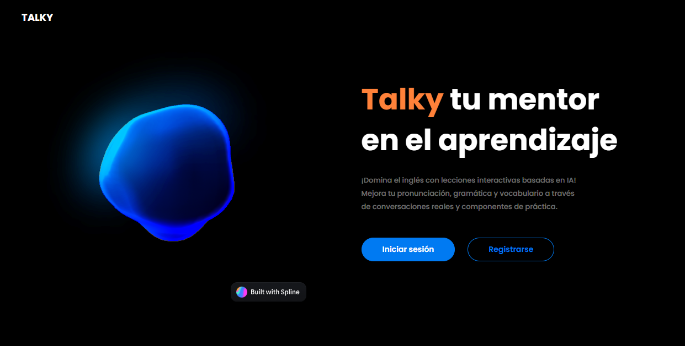
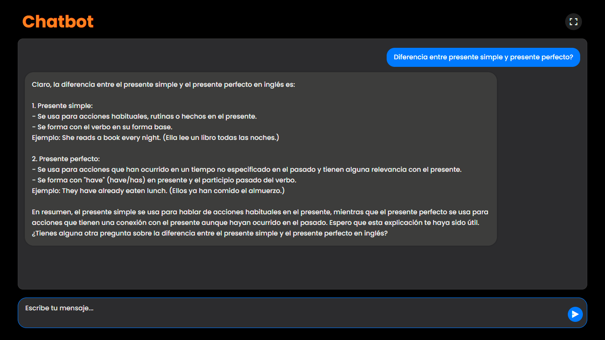
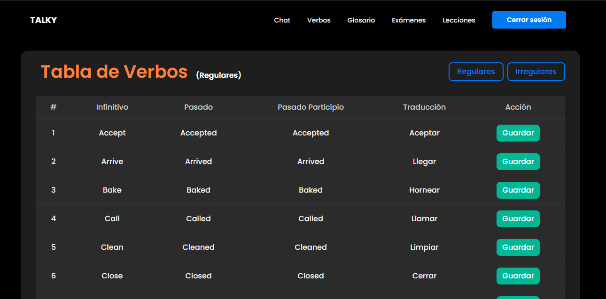

# Talky

**Talky** es una aplicación web **en desarrollo** orientada a estudiantes de inglés. Este repositorio contiene la parte del frontend, desarrollada en React con Vite y TailwindCSS.

La aplicación funciona como un asistente conversacional que permite practicar inglés mediante chat interactivo. Incluye herramientas adicionales como un glosario de palabras y una tabla de verbos.

El sistema se conecta con n8n y la API de OpenAI, y utiliza AWS Cognito y Amplify para la autenticación de usuarios.

<h3>🏆 Certificado Mejor proyecto PPI T&T, categoría cuarto semestre, año 2025-2</h3>

---

## Características del Frontend

- Chat interactivo conectado a la API (vía n8n).
- Autenticación de usuarios con AWS Cognito y Amplify.
- Componentes disponibles:
  - Chat funcional.
  - Tabla de verbos regulares e irregulares.
  - Glosario personalizado por usuario.
  - Registro, inicio de sesión y recuperación de contraseña.
- Interfaz moderna desarrollada con React + Vite + TailwindCSS.

---

## Tecnologías

- Framework: React + Vite
- Estilos: TailwindCSS + CSS personalizado
- Autenticación: AWS Amplify + Cognito
- Integraciones: n8n + OpenAI

---

## Estado del Proyecto (Frontend)

- Chatbot: Implementado
- Autenticación: Implementada
- Tabla de verbos: Activa
- Glosario: Activo
- Registro, login, recuperación: Activos
- Lecciones: Pendientes
- Exámenes: Pendientes

---

## Seguridad

Este repositorio no incluye claves privadas. Las configuraciones sensibles deben mantenerse en `amplifyconfiguration.json` y nunca deben subirse a control de versiones. Se debe asegurar de usar un archivo `.gitignore` adecuado.

---

## Repositorio Backend

El backend de la aplicación se encuentra en un repositorio aparte, desarrollado con:
- Java
- Spring Boot
- PostgreSQL
